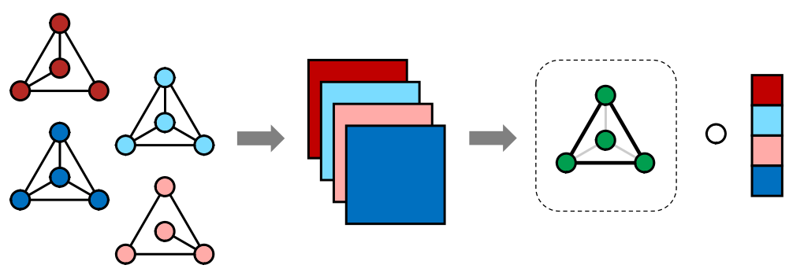

**Abstract:** In a number of application domains, one observes a sequence of network data; for example, repeated measurements between users interactions in social media platforms, financial correlation networks over time, or across subjects, as in multi-subject studies of brain connectivity. One way to analyze such data is by stacking networks into a third-order array or tensor. We propose a principal components analysis (PCA) framework for sequence network data, based on a novel decomposition for semi-symmetric tensors. We derive efficient algorithms for computing our proposed "Coupled CP" decomposition and establish estimation consistency of our approach under an analogue of the spiked covariance model with rates the same as the matrix case up to a logarithmic term. Our framework inherits many of the strengths of classical PCA and is suitable for a wide range of unsupervised learning tasks, including identifying principal networks, isolating meaningful changepoints or outliers across observations, and for characterizing the "variability network" of the most varying edges. Finally, we demonstrate the effectiveness of our proposal on simulated data and on examples from political science and financial economics. The proof techniques used to establish our main consistency results are surprisingly straight-forward and may find use in a variety of other matrix and tensor decomposition problems. 

**Working Copy:** ArXiv [2202.04719](https://arxiv.org/abs/2202.04719)

**Summary:** We develop and approach for performing Principal Components Analysis (PCA) on *network series* data - sets of networks observed on the same node set. Network series data are observed when a changing network is observed over time (*e.g.*, a social media network at the end of each week) or when a statistical network is estimated from time series data (*e.g.*, stock market correlation networks in different years). We approach this problem by embedding the network series in a **semi-symmetric** tensor and performing tensor PCA on this representation. 

We rigorously analyze Tensor PCA in the semi-symmetric context, proving consistency under an analogue of the "low-rank + noise" model for matrix PCA: somewhat remarkably, despite the difficulty of the tensor setting, our results are within a logarithmic factor of classical PCA results. Our proof technique depends on the classical Davis-Kahan theorem (and some painful algebra) and we hope to apply it further to a variety of tensor decomposition problems. Finally, we apply our method to a variety of synthetic and real data sets and find some counter-intuitive results about the Supreme Court of the United States. 

{width=135%,height=200%}
