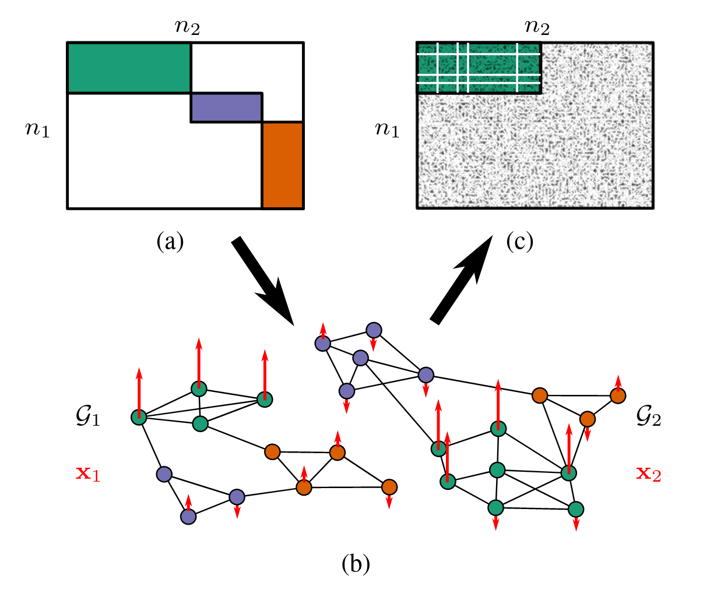

**Abstract:** Graph signal processing (GSP) provides a powerful framework for analyzing signals arising in a variety of domains. In many applications of GSP, multiple network structures are available, each of which captures different aspects of the same underlying phenomenon. To integrate these different data sources, graph alignment techniques attempt to find the best correspondence between vertices of two graphs. We consider a generalization of this problem, where there is no natural one-to-one mapping between vertices, but where there is correspondence between the community structures of each graph. Because we seek to learn structure at this higher community level, we refer to this problem as "coarse" graph alignment.  To this end, we propose a novel regularized partial least squares method which both incorporates the observed graph structures and imposes sparsity in order to reflect the underlying block community structure. We provide efficient algorithms for our method and demonstrate its effectiveness in simulations.

**Publisher DOI:** [10.1109/SSP49050.2021.9513753](https://doi.org/10.1109/SSP49050.2021.9513753)

**Working Copy:** ArXiv [2104.02810](https://arxiv.org/abs/2104.02810)

<hr> 

**Summary:** We consider the problem of aligning two graphs on different node sets, *e.g.*, Facebook and Twitter. Many users may be represented on both networks, but there are also a large number of users who use only one social media platform. Solving this problem exactly entails a (generalization) of the NP-hard graph-alignment problem, so we consider a relaxation in which we seek to find corresponding **communities** (*e.g.*, basset hound enthusiasts) across both networks. To do so, we assume that common signals are observed on both networks (*e.g.*, interest in a particular celebrity dog) and use that signal to align communities. Because this approach aligns communities rather than nodes and does so using (potentially noisy) signals, we refer to the resulting problem as the **CONGA** problem (Coarse Noisy Graph Alignment). 



We proceed by constructing the signal correlation matrix across the two graphs and performing a regularized SVD on this inner product: 

\begin{align*}
    \text{arg max}_{\mathbf{U}, \mathbf{V}} & \text{Tr}(\mathbf{U}^{\top}\mathbf{X}_1^\top\mathbf{X}_2\mathbf{V}) - \lambda_1P_1(\mathbf{U}) - \lambda_2P_2(\mathbf{V})  \\ 
    \text{subject to }&{\mathbf{U} \in \textsf{conv}\,\mathcal{V}^{\mathbf{I}_{n_1} + \alpha_1\mathbf{L}_1}_{n_1 \times K}, \mathbf{V} \in \textsf{conv}\,\mathcal{V}^{\mathbf{I}_{n_2} + \alpha_2\mathbf{L}_2}_{n_2 \times K}}
\end{align*}

This approach builds on my work on [multi-rank sparse and functional PCA](publications/mrsfpca.html) and extends it to the partial least squares context. The use of the flexible SFPCA regularization framework allows us to simultaneously achieve four goals: 

- Each community is supported on a sparse set of graph 1 nodes ($P_1(\mathbf{U})$)
- Each community is supported on a sparse set of graph 2 nodes ($P_2(\mathbf{V})$)
- Each community is well clustered with respect to graph 1, *i.e.*, each community is smooth with respect to the Laplacian $\mathbf{L}_1$
- Each community is well clustered with respect to graph 2, *i.e.*, each community is smooth with respect to the Laplacian $\mathbf{L}_2$

The resulting estimator is computationally efficient and performs well in simulation, as shown in our paper. We  hope to further study this model theoretically, but correlated sampling of graphs on different node sets is a tricky and open problem. If you have particular expertise in this area, please do get in touch!

**Presentations:** I presented on this work at SSP 2021, which was held virtually. A recording of my presentation can be found below: 

<iframe width="560" height="315" src="https://www.youtube.com/embed/vTZ_fmjK5Ig" title="YouTube video player" frameborder="0" allow="accelerometer; autoplay; clipboard-write; encrypted-media; gyroscope; picture-in-picture" allowfullscreen></iframe>

[View on YouTube](https://www.youtube.com/watch?v=vTZ_fmjK5Ig). Slides from this talk can be found [here](../assets/conga/ssp_talk.pdf).

<hr>

**Citation:**

```
@INPROCEEDINGS{Weylandt:2021-CONGA,
  AUTHOR="Michael Weylandt and George Michailidis and T. Mitchell Roddenberry",
  TITLE="Sparse Partial Least Squares for Coarse Noisy Graph Alignment",
  DOI="10.1109/SSP49050.2021.9513753"
  PAGES={561-565},
  CROSSREF="SSP:2021"
}

@PROCEEDINGS{SSP:2021,
  BOOKTITLE="SSP 2021: Proceedings of the 2021 IEEE Statistical Signal Processing Workshop",
  YEAR=2021,
  LOCATION="Rio de Janeiro, Brazil"
  EDITOR="Jose Carlos Moreira Bermudez and Vitor H. Nascimento"
}
```
