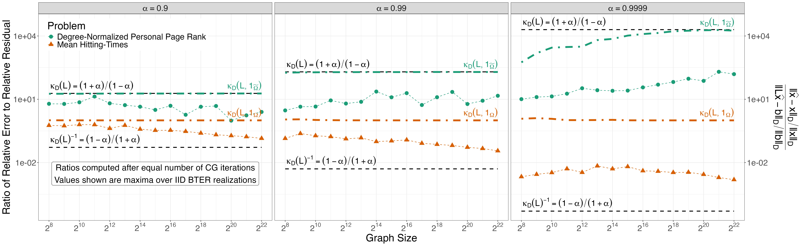

**Abstract:** We show that certain Graph Laplacian linear sets of equations exhibit optimal accuracy, guaranteeing that the relative error is no larger than the norm of the relative residual and that optimality occurs for carefully chosen right-hand sides. Such sets of equations arise in PageRank and Markov chain theory. We establish new relationships among the PageRank teleportation parameter, the Markov chain discount, and approximations to linear sets of equations. The set of optimally accurate systems can be separated into two groups for an undirected graph---those that achieve optimality asymptotically with the graph size and those that do not---determined by the angle between the right-hand side of the linear system and the vector of all ones.  We provide supporting numerical experiments. 

**Working Copy:** ArXiv [2405.07877](https://arxiv.org/abs/2405.07877)

<hr>

**Summary:** In this work, we consider linear systems of the form $Lx = b$, where $L$ is a suitable graph Laplacian. Classical analysis would suggest that these problems are *very poorly* conditioned, due to the many small near-zero singular values of $L$. In practice, however, these systems are solved to high accuracy quite regularly. 

We reconcile these observations through the notion of a *data-dependent condition number*: the classical condition number of a matrix is more formally its condition number with respect to inversion. And inverting a matrix directly is a terrible way to solve $Lx = b$! More formally, if $L$ is well-conditioned for inversion, than $Lx = b$ should be well-conditioned for any $b$ - but that's far stronger than what we need in practice, where we only consider a small range of $b$. By instead performing a conditioning analysis of the specific $Lx = b$ system, not just $L$, we find that for many interesting $b$, the problem is *very well* conditioned, with condition number approaching $1$ for the linear system used to compute expected hitting times of simple random walks on very large undirected graphs. 

Our analysis is "classical" relying only on a suitable eigendecomposition of $L$ and careful consideration of the problem geometry. A particularly useful result is Proposition 2, which gives bounds on the conditioning that can be computed without requiring any iterative solver to be used. (Classical conditioning analysis requires computing the spectrum of $L$; general data-dependent conditioning analysis requires knowledge of the true solution $x$ and the eigendecomposition of $L$) This sort of *a priori* bound is immensely useful in practice, as it allows us to decide whether a PageRank problem or its 'dual' hitting time problem will yield a better conditioned system for a particular analysis. 



The presentation in this paper is quite brief and intentionally self-contained. A longer manuscript, showing how our results can be applied to discrete potential problems and Laplacian systems generally, is in preparation. 

<hr>

**Citation:**

```
@ARTICLE{Lehoucq:2024
  AUTHOR="Richard B. Lehoucq and Michael Weylandt and Jonathan W. Berry",
  TITLE="Optimal accuracy for linear sets of equations with the graph {L}aplacian",
  JOURNAL="ArXiv Pre-Print 2405.07877",
  YEAR=2024,
  URL="https://arxiv.org/abs/2405.07877"
}
```
