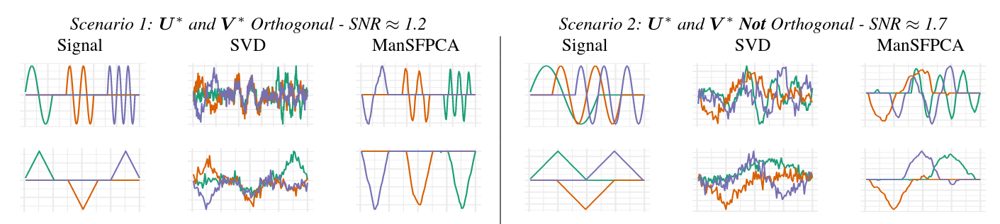

**Abstract:** We consider the problem of estimating multiple principal components using the recently-proposed Sparse and Functional Principal Components Analysis (SFPCA) estimator. We first propose an extension of SFPCA which estimates several principal components simultaneously using manifold optimization techniques to enforce orthogonality constraints. While effective, this approach is computationally burdensome so we also consider iterative deflation approaches which take advantage of existing fast algorithms for rank-one SFPCA. We show that alternative deflation schemes can more efficiently extract signal from the data, in turn improving estimation of subsequent components. Finally, we compare the performance of our manifold optimization and deflation techniques in a scenario where orthogonality does not hold and find that they still lead to significantly improved performance.

**Publisher DOI:** [10.1109/CAMSAP45676.2019.9022486](https://doi.org/10.1109/CAMSAP45676.2019.9022486)

**Working Copy:** ArXiv [1907.12012](https://arxiv.org/abs/1907.12012)


<hr>

**Summary:** This work extends my [previous work on Sparse and Functional PCA](sfpca.html) to the case of estimating multiple principal components. While classical PCA gives nicely orthogonal and simultaneously estimable^[Taking the eigendecomposition as an "atomic" operation] components, the situation for sparse PCA is less compelling. I translate the rank-1 SFPCA problem to a rank-$k$ optimization problem over a pair of generalized Stiefel manifolds:
\[\text{arg max}_{\mathbf{U} \in \mathcal{V}_{n\times k}^{\mathbf{S}_u}, \mathbf{V} \in \mathcal{V}_{p \times k}^{\mathbf{S}_v}} \text{Tr}(\mathbf{U}^T\mathbf{X}\mathbf{V}) - \lambda_{\mathbf{U}} P_{\mathbf{U}}(\mathbf{U}) - \lambda_{\mathbf{V}} P_{\mathbf{V}}(\mathbf{V})\]
To solve this problem, I take advantage recent non-smooth manifold-constrained optimization schemes[^1] and show that superior solutions can be obtained for reasonable sized-problems. (These methods require one or more matrix decompositions at each iteration, so they don't scale to very large data.) While directly solving the rank-$k$ problem is best, I also propose some improvements to the greedy rank-1 strategy that guarantee weaker forms of orthogonality. These improvements cannot impose true orthogonality, but they do guarantee that the estimated principal components are "residual-orthogonal" which ultimately improves statistical performance: 

| Method | Two-Way Orthogonality $u^TX_tv = 0$ | One-Way Orthogonality $u^TX_t, X_tv = 0$| Subsequent Orthogonality $u^TX_{t + s}, X_{t + s}v = 0$ for all $s$ | Robust to Scale |
|--------|-----------------------|-----------------------|--------------------------|-----------------|
| Hotelling Deflation| ✓ | X | X | X |
| Projection Deflation | ✓ | ✓ | X | X |
| Schur Deflation | ✓ | ✓ | ✓ | ✓

Interestingly, all these forms of orthogonality tend to give improved performance, even when the underlying signal is not orthogonal.



**Related Software:** [*MoMA*](software/moma.html)


<hr>

**Citation:**

```
@INPROCEEDINGS{Weylandt:2019-MRSFPCA,
  TITLE="Multi-Rank Sparse and Functional {PCA}: Manifold Optimization and Iterative Deflation Techniques",
  AUTHOR="Michael Weylandt",
  CROSSREF={CAMSAP:2019},
  DOI="10.1109/CAMSAP45676.2019.9022486",
  PAGES={500-504}
}

@PROCEEDINGS{CAMSAP:2019,
  TITLE="{CAMSAP} 2019: Proceedings of the 8\textsuperscript{th} {IEEE} Workshop on Computational Advances in Multi-Sensor Adaptive Processing",
  YEAR=2019,
  LOCATION="Le Gosier, Guadaloupe",
  EDITOR="Geert Leus and Antonio G. Marques"
}
```


[^1]: Unpublished as of 2019: now published as\
\
- S. Chen, S. Ma, A. M.-C. So, and T. Zhang, "Proximal gradient method for
nonsmooth optimization over the Stiefel manifold," *SIAM Journal on Optimization*, vol. 30, no. 1, pp. 210–239, 2020.\
\
- S. Chen, S. Ma, L. Xue, and H. Zou, "An alternating manifold proximal gradient method for sparse principal component analysis and sparse canonical correlation analysis," *INFORMS Journal on Optimization*, vol. 2, no. 3, pp. 192–
208, 2020.
